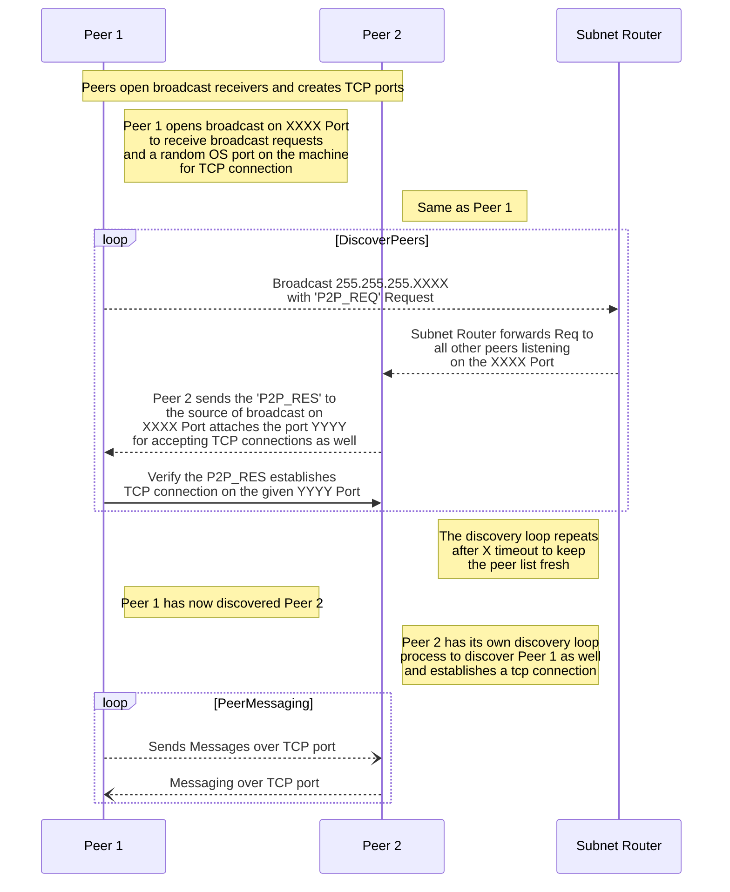

## P2P data transfer with timeout based peer discovery system w/ UDP and TCP protocols

```mermaid
sequenceDiagram
    Note over Peer 1, Peer 2: Peers open broadcast receivers and creates TCP ports
    Note right of Peer 1: Peer 1 opens broadcast on XXXX Port<br/> to receive broadcast requests<br/> and a random OS port on the machine <br/> for TCP connection
    Note right of Peer 2: Same as Peer 1
    loop DiscoverPeers
        Peer 1 -->> Subnet Router: Broadcast 255.255.255.XXXX<br/> with 'P2P_REQ' Request
        Subnet Router -->> Peer 2: Subnet Router forwards Req to<br/> all other peers listening<br/>on the XXXX Port
        Peer 2 -->> Peer 1: Peer 2 sends the 'P2P_RES' to<br/> the source of broadcast on<br/> XXXX Port attaches the port YYYY <br/>for accepting TCP connections as well
        Peer 1 ->> Peer 2: Verify the P2P_RES establishes<br/> TCP connection on the given YYYY Port
    end
    Note left of Subnet Router: The discovery loop repeats<br/> after X timeout to keep <br/> the peer list fresh
    Note right of Peer 1: Peer 1 has now discovered Peer 2
    Note right of Peer 2: Peer 2 has its own discovery loop <br/>process to discover Peer 1 as well <br/> and establishes a tcp connection
    loop PeerMessaging
        Peer 1 --) Peer 2: Sends Messages over TCP port
        Peer 2 --) Peer 1: Messaging over TCP port
    end

```
