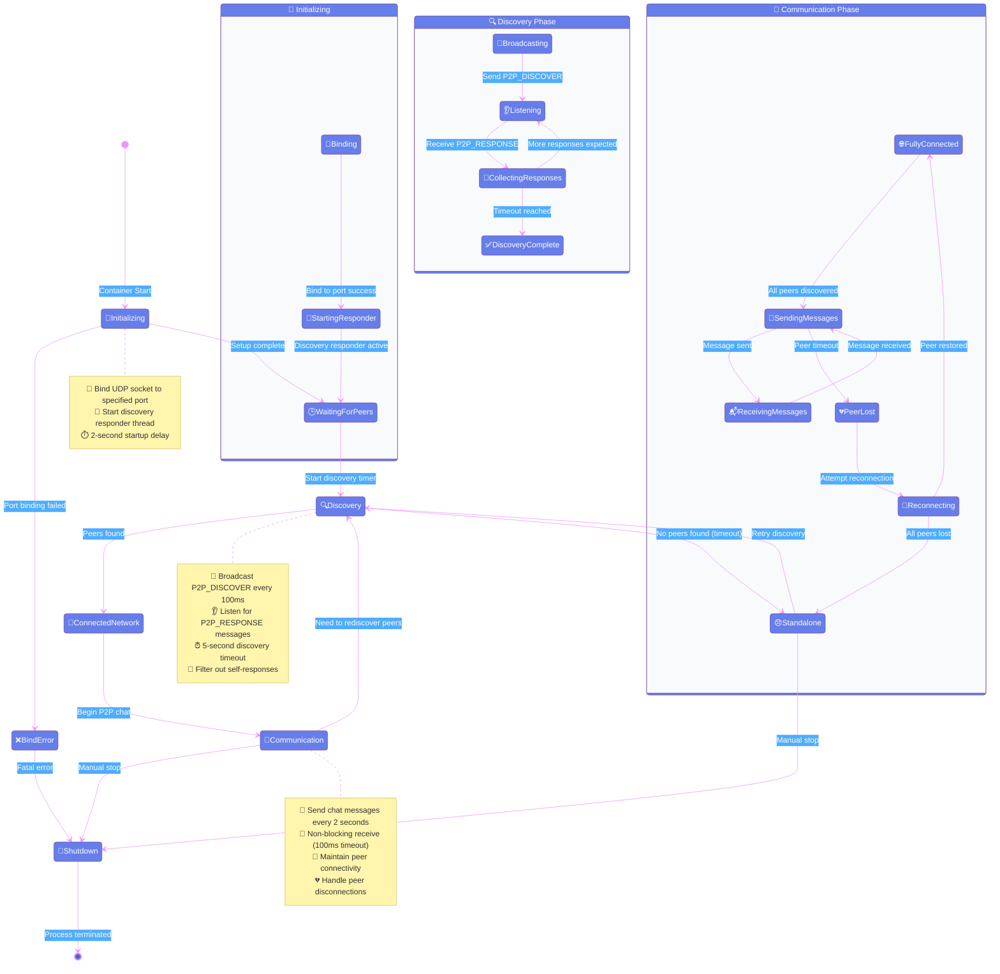

```mermaid
  %%{init: {
  'theme': 'base',
  'themeVariables': {
    'primaryColor': '#997eea',
    'primaryTextColor': '#ffffff',
    'primaryBorderColor': '#764ba2',
    'lineColor': '#f093fb',
    'secondaryColor': '#4facfe',
    'tertiaryColor': '#43e97b',
    'background': '#f8fafc',
    'mainBkg': '#667eea',
    'secondBkg': '#764ba2',
    'tertiaryColor': '#38ef7d'
  }
}}%%
stateDiagram-v2
    [*] --> 🚀Initializing: Container Start
    state "🚀 Initializing" as init {
🔧Binding --> 🎯StartingResponder: Bind to port success
🎯StartingResponder --> 🕒WaitingForPeers: Discovery responder active
}

state "🔍 Discovery Phase" as discovery {
📡Broadcasting --> 👂Listening: Send P2P_DISCOVER
👂Listening --> 📝CollectingResponses: Receive P2P_RESPONSE
📝CollectingResponses --> 👂Listening: More responses expected
📝CollectingResponses --> ✅DiscoveryComplete: Timeout reached
}

state "💬 Communication Phase" as communication {
🌐FullyConnected --> 📨SendingMessages: All peers discovered
📨SendingMessages --> 📬ReceivingMessages: Message sent
📬ReceivingMessages --> 📨SendingMessages: Message received
📨SendingMessages --> 💔PeerLost: Peer timeout
💔PeerLost --> 🔄Reconnecting: Attempt reconnection
🔄Reconnecting --> 🌐FullyConnected : Peer restored
🔄Reconnecting --> 😞Standalone: All peers lost
}

🚀Initializing --> 🕒WaitingForPeers: Setup complete
🕒WaitingForPeers --> 🔍Discovery: Start discovery timer

🔍Discovery --> 🎉ConnectedNetwork: Peers found
🔍Discovery --> 😞Standalone: No peers found (timeout)

🎉ConnectedNetwork --> 💬Communication: Begin P2P chat

😞Standalone --> 🔍Discovery: Retry discovery
😞Standalone --> 🛑Shutdown: Manual stop

💬Communication --> 🔍Discovery: Need to rediscover peers
💬Communication --> 🛑Shutdown: Manual stop

🛑Shutdown --> [*]: Process terminated

%% Error states
🚀Initializing --> ❌BindError : Port binding failed
❌BindError --> 🛑Shutdown: Fatal error

%% Notes with emojis and colors
note right of 🚀Initializing
🔧 Bind UDP socket to specified port
🎯 Start discovery responder thread
⏱️ 2-second startup delay
end note

note right of 🔍Discovery
📢 Broadcast P2P_DISCOVER every 100ms
👂 Listen for P2P_RESPONSE messages
⏰ 5-second discovery timeout
🎯 Filter out self-responses
end note

note right of 💬Communication
💌 Send chat messages every 2 seconds
📱 Non-blocking receive (100ms timeout)
🔄 Maintain peer connectivity
💔 Handle peer disconnections
end note
```